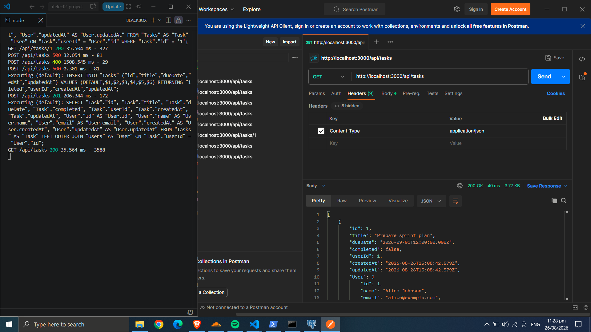
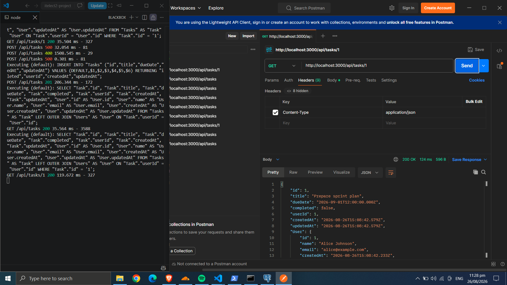
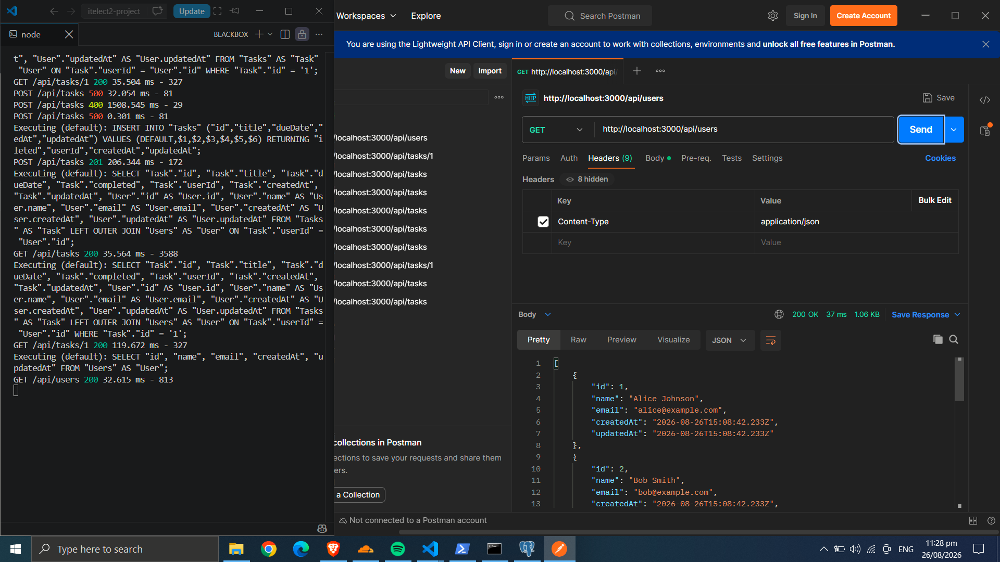
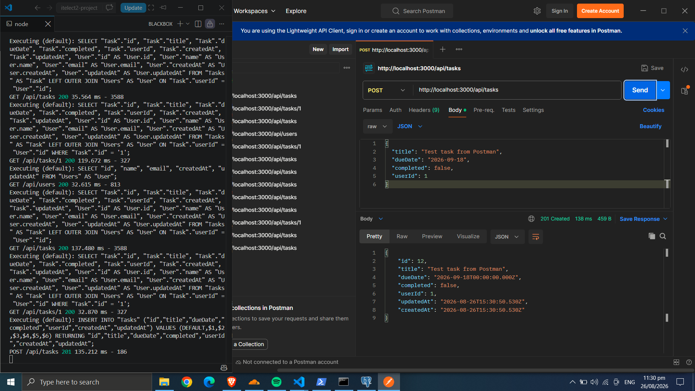
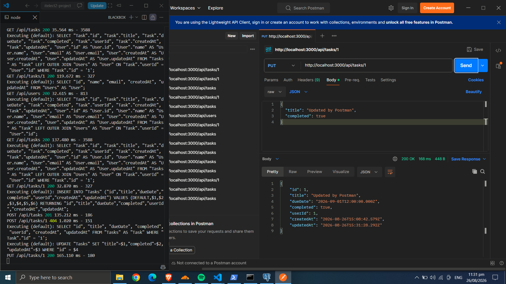
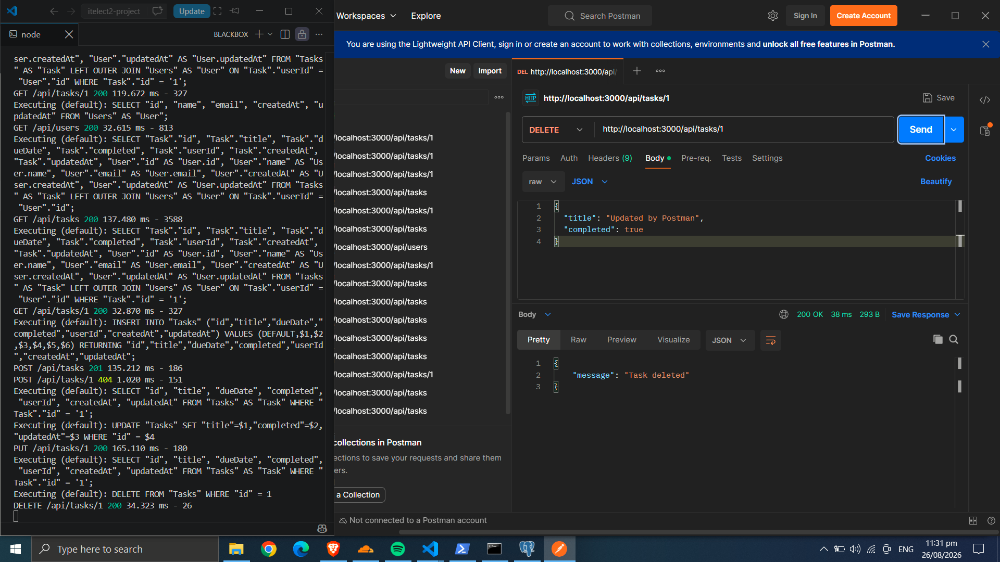

# itelect2-project
My IT Elective 2 backend web development project.
## Postman Screenshots
GET all tasks

GET one task by ID

GET all users

POST create a task

PUT update a task

DELETE a task
